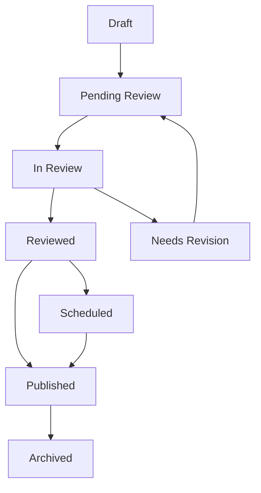

# BENIRAGE CMS - Content Workflow Process

## Overview

The BENIRAGE CMS implements a sophisticated multi-stage content workflow that ensures quality, accuracy, and proper oversight throughout the content lifecycle. This document explains the complete workflow process from content creation to archival.

## 🎯 Workflow Objectives

**Quality Assurance:**
- ✅ **Multi-stage Review** - Multiple checkpoints for quality
- ✅ **Role-based Approval** - Appropriate oversight at each stage
- ✅ **Audit Trail** - Complete history of all changes
- ✅ **Version Control** - Track all modifications and revisions

**Process Efficiency:**
- ✅ **Streamlined Approval** - Clear paths for different content types
- ✅ **Automated Notifications** - Timely alerts for all stakeholders
- ✅ **Status Tracking** - Real-time visibility into content progress
- ✅ **Deadline Management** - Publication scheduling and reminders

---

## 📋 Content Lifecycle Stages

### Stage 1: Content Creation (Draft)
**Status:** `draft`

**Responsible Role:** Author/Editor

**Activities:**
1. **Content Planning**
   - Research and outline content structure
   - Gather necessary resources and media
   - Define target audience and objectives

2. **Content Writing**
   - Write compelling title and introduction
   - Develop comprehensive body content
   - Include relevant media and links
   - Optimize for SEO and accessibility

3. **Initial Review**
   - Self-review for clarity and completeness
   - Check formatting and visual elements
   - Verify all links and media are functional

**Quality Gates:**
- [ ] Content is complete and well-structured
- [ ] All required fields are filled
- [ ] Media elements have proper alt text
- [ ] SEO meta data is optimized

---

### Stage 2: Review Submission (Pending Review)
**Status:** `pending_review`

**Responsible Role:** Author/Editor → Reviewer

**Submission Process:**
1. **Pre-submission Checklist**
   ```typescript
   interface SubmissionChecklist {
     content_complete: boolean;
     grammar_checked: boolean;
     seo_optimized: boolean;
     media_ready: boolean;
     links_tested: boolean;
   }
   ```

2. **Submit for Review**
   - Click "Submit for Review" button
   - Add optional review notes for reviewers
   - Select appropriate reviewer(s)
   - Confirm submission

3. **Reviewer Notification**
   - Automatic notification sent to assigned reviewers
   - Content appears in reviewer's dashboard
   - Review deadline set based on content priority

**Transition Criteria:**
- Content marked as complete by author
- All required fields populated
- Author confirms readiness for review

---

### Stage 3: Review & Feedback (In Review)
**Status:** `in_review`

**Responsible Role:** Reviewer

**Review Process:**

1. **Content Assessment**
   - Evaluate content quality and relevance
   - Check factual accuracy and source credibility
   - Verify brand voice and tone consistency
   - Assess SEO optimization and technical elements

2. **Detailed Review**
   ```typescript
   interface ReviewCriteria {
     quality: {
       grammar: boolean;
       clarity: boolean;
       structure: boolean;
       engagement: boolean;
     };
     accuracy: {
       facts_verified: boolean;
       sources_credible: boolean;
       data_current: boolean;
     };
     compliance: {
       brand_guidelines: boolean;
       legal_requirements: boolean;
       accessibility_standards: boolean;
     };
     seo: {
       meta_optimized: boolean;
       keywords_present: boolean;
       internal_linking: boolean;
     };
   }
   ```

3. **Review Decision**
   - **Approve** - Content meets all standards
   - **Request Revisions** - Minor or major changes needed
   - **Reject** - Content doesn't meet requirements

**Review Timeline:**
- **Standard Content** - 1-2 business days
- **Priority Content** - Same day review
- **Complex Content** - 3-5 business days

---

### Stage 4: Revisions & Improvements (Needs Revision)
**Status:** `needs_revision`

**Responsible Role:** Author/Editor

**Revision Process:**
1. **Review Feedback**
   - Read reviewer comments carefully
   - Understand specific requested changes
   - Ask questions if feedback is unclear

2. **Implement Changes**
   - Address all reviewer concerns
   - Make improvements to content quality
   - Update based on feedback and suggestions

3. **Resubmission**
   - Confirm all changes are complete
   - Add notes about revisions made
   - Resubmit for review

**Common Revision Types:**
- **Content Changes** - Rewrite sections for clarity
- **Factual Corrections** - Fix inaccurate information
- **SEO Improvements** - Optimize meta data and keywords
- **Style Adjustments** - Match brand voice and tone
- **Technical Fixes** - Correct links, images, formatting

---

### Stage 5: Final Approval (Reviewed)
**Status:** `reviewed`

**Responsible Role:** Senior Reviewer/Admin

**Approval Process:**
1. **Final Quality Check**
   - Verify all reviewer feedback addressed
   - Confirm content meets organizational standards
   - Check for any remaining issues

2. **Publication Planning**
   - Set publication date and time
   - Configure visibility settings
   - Plan promotional activities

3. **Final Approval**
   - Mark content as approved
   - Set publication schedule
   - Notify relevant stakeholders

**Approval Authority:**
- **Standard Approval** - Content reviewers
- **Senior Approval** - Department heads for major content
- **Executive Approval** - Leadership for critical content

---

### Stage 6: Publication (Published)
**Status:** `published`

**Responsible Role:** System/Automated

**Publication Process:**
1. **Automated Publishing**
   - Content automatically published at scheduled time
   - SEO meta data applied
   - Social media notifications sent (if configured)

2. **Visibility Updates**
   - Content appears on public website
   - Search engine indexing triggered
   - RSS feeds updated

3. **Notification & Alerts**
   - Author notified of publication
   - Team members alerted
   - Analytics tracking begins

**Publication Types:**
- **Immediate** - Publish as soon as approved
- **Scheduled** - Publish at specific date/time
- **Embargoed** - Hold for specific release time

---

### Stage 7: Content Management (Live)
**Status:** `published` (Active Management)

**Responsible Role:** Content Manager/Editor

**Ongoing Activities:**
1. **Performance Monitoring**
   - Track page views and engagement
   - Monitor user feedback and comments
   - Analyze SEO performance

2. **Content Updates**
   - Refresh time-sensitive information
   - Add new relevant content or links
   - Improve based on performance data

3. **User Engagement**
   - Respond to comments and questions
   - Share on social media platforms
   - Encourage community interaction

---

### Stage 8: Archival (Archived)
**Status:** `archived`

**Responsible Role:** Admin/Content Manager

**Archival Process:**
1. **Archive Decision**
   - Content becomes outdated
   - Replaced by newer version
   - Seasonal or time-sensitive content

2. **Archival Actions**
   - Remove from main navigation
   - Add archive notice if needed
   - Preserve for historical reference

3. **SEO Considerations**
   - Redirect to replacement content if applicable
   - Remove from XML sitemap
   - Update internal links

**Archival Triggers:**
- Content becomes factually incorrect
- Replaced by comprehensive update
- Seasonal content no longer relevant
- Organizational strategy changes

---

## 🔄 Workflow Transitions

### State Transition Diagram



### Transition Rules

**Draft → Pending Review:**
- Author marks content as complete
- All required fields filled
- Author confirms readiness

**Pending Review → In Review:**
- Reviewer accepts assignment
- Review process begins

**In Review → Reviewed:**
- Reviewer approves content
- All quality criteria met

**In Review → Needs Revision:**
- Reviewer requests changes
- Specific feedback provided

**Needs Revision → Pending Review:**
- Author completes requested changes
- Resubmitted for review

**Reviewed → Published:**
- Final approver confirms publication
- Publication scheduled or immediate

**Published → Archived:**
- Content becomes outdated
- Admin initiates archival

---

## 👥 Role Responsibilities

### Content Workflow Roles

| Role | Responsibilities | Permissions |
|------|------------------|-------------|
| **Author** | Create drafts, submit for review | Create, edit own content |
| **Editor** | Create, edit, manage content | Full content management |
| **Reviewer** | Review and approve content | Review, approve, request revisions |
| **Admin** | Final approval, archival | Full system access |
| **Super Admin** | Override any decision | Complete system control |

### Permission Matrix

**Content Creation:**
- Authors can create drafts
- Editors can create and publish directly
- Admins have full content control

**Review Process:**
- Reviewers can approve/reject content
- Authors cannot approve own content
- Multiple reviewers may be assigned

**Publication:**
- Approved content can be published
- Scheduled publication available
- Emergency publishing for admins

---

## ⏰ Timeline Management

### Standard Timelines

**Content Creation:**
- **Simple Content** - 2-4 hours
- **Complex Content** - 1-3 days
- **Research-Intensive** - 3-7 days

**Review Process:**
- **Standard Review** - 1-2 business days
- **Priority Review** - Same day
- **Complex Review** - 3-5 business days

**Publication:**
- **Immediate** - Within 1 hour of approval
- **Scheduled** - At specified date/time
- **Embargoed** - Hold until release time

### Deadline Management

**Review Deadlines:**
- Assigned automatically based on content priority
- Escalation process for overdue reviews
- Notification system for approaching deadlines

**Publication Schedules:**
- Editorial calendar integration
- Seasonal content planning
- Campaign coordination

---

## 📊 Workflow Analytics

### Performance Metrics

**Content Velocity:**
- Average time from draft to publication
- Review completion rates
- Revision frequency

**Quality Indicators:**
- Approval rates by reviewer
- Common revision requests
- Content performance post-publication

**Efficiency Metrics:**
- Time spent in each stage
- Bottleneck identification
- Resource utilization

### Process Optimization

**Continuous Improvement:**
1. **Regular Review** - Monthly workflow assessment
2. **Bottleneck Analysis** - Identify and resolve delays
3. **Training Needs** - Address common issues
4. **Process Updates** - Implement improvements

---

## 🚨 Exception Handling

### Emergency Procedures

**Urgent Content:**
1. **Fast-track Process** - Expedited review and approval
2. **Admin Override** - Skip standard workflow if needed
3. **Immediate Publication** - Emergency publishing capability

**Content Issues:**
1. **Takedowns** - Immediate removal if needed
2. **Corrections** - Rapid revision process
3. **Replacements** - Quick content substitution

### Escalation Process

**Review Escalation:**
1. **Initial Reviewer** - Standard review process
2. **Senior Reviewer** - If complex issues arise
3. **Admin Override** - For policy or strategic decisions

**Technical Issues:**
1. **Content Editor** - Formatting and display problems
2. **System Admin** - Platform functionality issues
3. **Technical Support** - Infrastructure problems

---

## 🔧 Workflow Configuration

### Customizable Elements

**Review Settings:**
- Number of required reviewers
- Review assignment rules
- Approval thresholds
- Escalation timelines

**Content Types:**
- Different workflows for different content types
- Category-specific requirements
- Priority-based processing

**Notification Rules:**
- Who gets notified at each stage
- Notification frequency and method
- Escalation alerts

### Workflow Templates

**Standard Templates:**
- **Blog Post Workflow** - Standard review process
- **News Article Workflow** - Fast-track for timely content
- **Policy Document Workflow** - Enhanced review requirements
- **Marketing Content Workflow** - Creative review focus

---

## 📱 User Interface Features

### Workflow Dashboard

**Reviewer Dashboard:**
- Queue of assigned reviews
- Review progress tracking
- Performance metrics
- Team activity overview

**Author Dashboard:**
- Submission status tracking
- Review feedback access
- Revision requirements
- Publication notifications

**Admin Dashboard:**
- Overall workflow health
- Bottleneck identification
- Quality metrics
- Process optimization opportunities

### Status Indicators

**Visual Status System:**
- **Color Coding** - Different colors for each status
- **Progress Bars** - Visual completion indicators
- **Time Stamps** - When each stage was completed
- **User Attribution** - Who performed each action

---

## 🔒 Security & Compliance

### Access Control

**Permission-based Access:**
- Users only see content they can act on
- Review assignments respect user permissions
- Audit trail for all workflow actions

**Content Security:**
- Draft content protected from unauthorized access
- Review process maintains content confidentiality
- Publication controlled by approval process

### Compliance Tracking

**Regulatory Compliance:**
- Content approval chains for regulated industries
- Documentation of review decisions
- Retention of review records
- Audit trails for compliance reporting

---

## 📚 Training & Documentation

### User Training

**Role-Specific Training:**
- **Authors** - Content creation and submission
- **Reviewers** - Review process and standards
- **Editors** - Content management and oversight
- **Admins** - System configuration and management

**Process Documentation:**
- Standard operating procedures
- Quality guidelines and checklists
- Troubleshooting guides
- Best practices and tips

---

## 🎯 Workflow Best Practices

### For Authors
- Plan content thoroughly before starting
- Use templates and style guides
- Submit complete, polished work
- Respond promptly to feedback

### For Reviewers
- Review content objectively and constructively
- Provide specific, actionable feedback
- Meet review deadlines consistently
- Help authors improve their skills

### For Administrators
- Monitor workflow health regularly
- Address bottlenecks promptly
- Update processes based on feedback
- Ensure proper training for all users

---

## 📈 Success Metrics

### Key Performance Indicators

**Efficiency Metrics:**
- Average time to publication
- Review completion rates
- User satisfaction scores

**Quality Metrics:**
- Content approval rates
- Reader engagement scores
- Error and revision rates

**Process Health:**
- Workflow adherence
- Deadline compliance
- User adoption rates

---

*This workflow process ensures that all content published through the BENIRAGE CMS meets the highest standards of quality, accuracy, and relevance while maintaining efficient processes and clear accountability.*